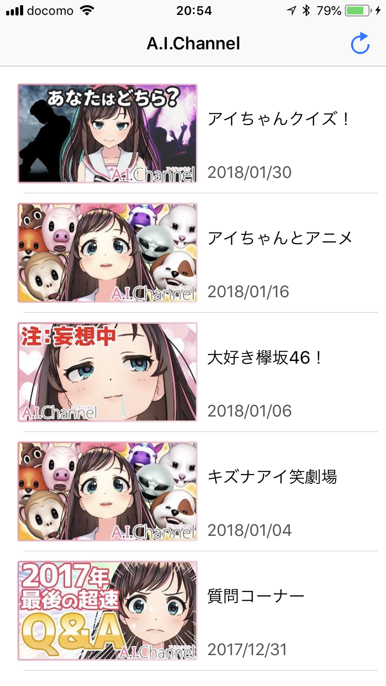
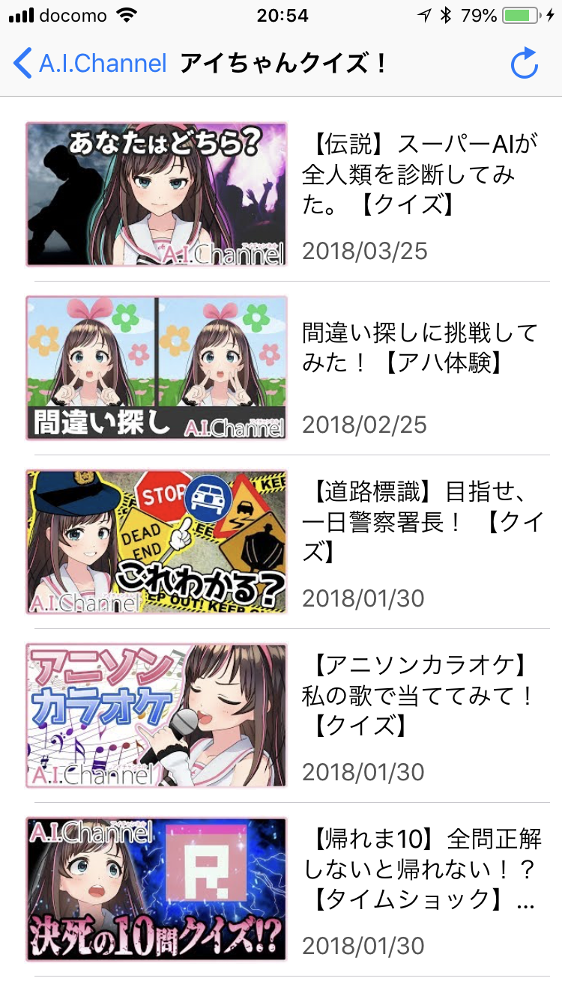
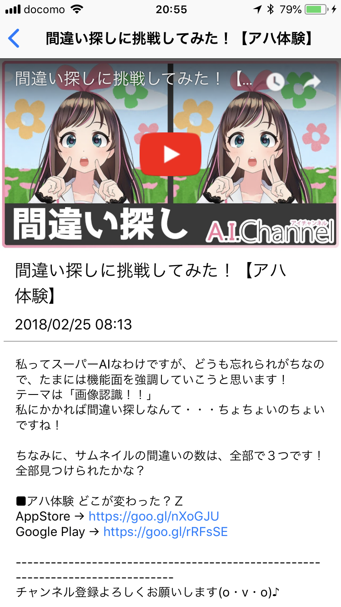

A.I. Sample
==========================

はじめに
--------
Youtube Data APIを使って[「A.I.Channel」](https://www.youtube.com/channel/UC4YaOt1yT-ZeyB0OmxHgolA) のプレイリストの動画を再生するiPhoneのサンプルアプリです。

機能
--------

- A.I.Channelのプレイリスト一覧表示
- プレイリスト内動画の一覧表示
- 動画の詳細表示
- 動画の再生

開発環境
--------
- Xcode 9.3 (9E145)
- macOS High Sierra 10.13.4
- Swift 4.1
- CocoaPods

対応端末
--------
- iPhone iOS 10.0以上

検証済端末
--------
- iPhone 8 (iOS 11.3.1)

使用しているCocoaPodsライブラリ
------------------------------------
- [Alamofire](https://github.com/Alamofire/Alamofire)
- [Himotoki](https://github.com/ikesyo/Himotoki)
- [XCGLogger](https://github.com/DaveWoodCom/XCGLogger)
- [Kingfisher](https://github.com/onevcat/Kingfisher)
- [RSLoadingView](https://github.com/roytornado/RSLoadingView)
- [YouTubePlayer](https://github.com/gilesvangruisen/Swift-YouTube-Player)

使用しているAPI
------------------------------------

- Youtube Data APIを使用しています。https://developers.google.com/youtube/v3/getting-started からAPI Keyを作成し、 `GlobalConstants.youtubeApiKey` に自分のAPI Keyを設定してください。
- 使用しているAPI名
  1. [playlist](https://developers.google.com/youtube/v3/docs/playlists/list)
  1. [playlistItems](https://developers.google.com/youtube/v3/docs/playlistItems/list)

Screenshots
------------------------------------
- プレイリスト一覧

- 動画一覧

- 動画詳細＆プレイヤー

その他
----
アイコン画像の著作権はA.I.Channelのものです。
